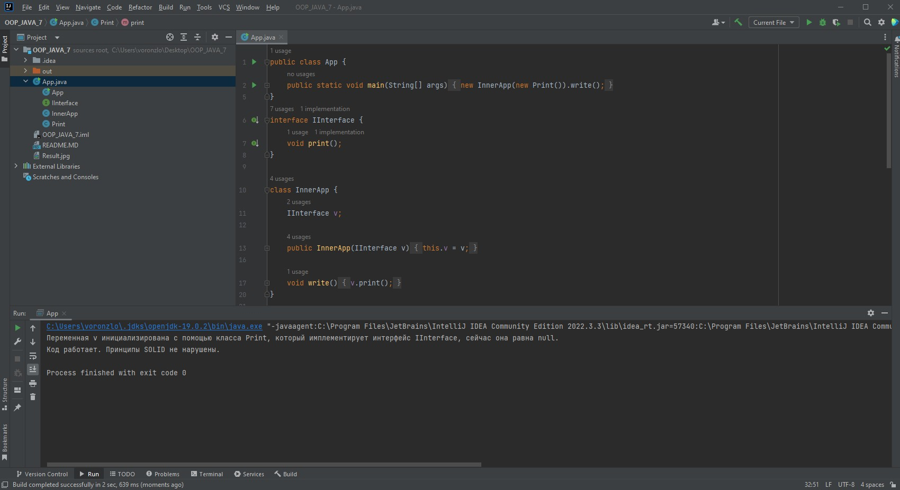

## Объектно-ориентированное программирование (семинары)

### Урок 7. ООП Дизайн и Solid ч.2
**Задание:**
***Заставить работать. (помним про SOLID)***

    public class App {

        public static void main(String[] args) {
        new InnerApp(null).write();
        }
    }

    interface IInterface {
        void print();
    }

    class InnerApp {
        IInterface v;

        public InnerApp(IInterface v) {
        this.v = v;
        }

        void write() {
            v.print();
        }
    }

Результат выполнения кода:

